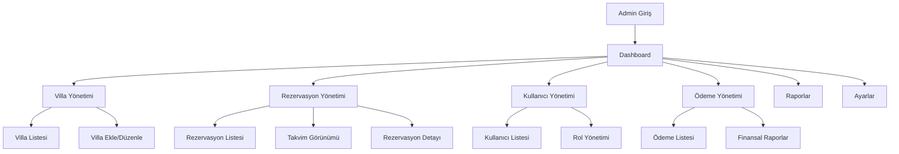

# Villa Kiralama Sistemi - Admin Paneli Ürün Gereksinimleri Dökümanı

## 1. Ürün Genel Bakış
Villa kiralama sistemi için kapsamlı admin paneli, sistem yöneticilerinin tüm operasyonları merkezi bir yerden yönetmesini sağlar.
- Villa, rezervasyon, kullanıcı ve ödeme süreçlerinin tam kontrolünü sunar
- Gerçek zamanlı istatistikler ve raporlama ile işletme performansını izleme imkanı

## 2. Temel Özellikler

### 2.1 Kullanıcı Rolleri
| Rol | Kayıt Yöntemi | Temel Yetkiler |
|-----|---------------|----------------|
| Super Admin | Sistem tarafından oluşturulur | Tüm modüllere tam erişim, kullanıcı yönetimi |
| Admin | Super Admin tarafından davet | Villa ve rezervasyon yönetimi, raporlar |
| Moderatör | Admin tarafından davet | Sadece rezervasyon onaylama ve müşteri desteği |

### 2.2 Özellik Modülleri
Admin paneli aşağıdaki ana sayfalardan oluşur:
1. **Dashboard**: Genel istatistikler, hızlı erişim menüsü, son aktiviteler
2. **Villa Yönetimi**: Villa listesi, villa ekleme/düzenleme, fotoğraf yönetimi
3. **Rezervasyon Yönetimi**: Rezervasyon listesi, onaylama/iptal, takvim görünümü
4. **Kullanıcı Yönetimi**: Kullanıcı listesi, rol atama, hesap durumu yönetimi
5. **Ödeme Yönetimi**: Ödeme geçmişi, geri ödemeler, finansal raporlar
6. **Raporlar**: Gelir raporları, doluluk oranları, performans analizi
7. **Ayarlar**: Sistem ayarları, e-posta şablonları, genel konfigürasyon

### 2.3 Sayfa Detayları
| Sayfa Adı | Modül Adı | Özellik Açıklaması |
|-----------|-----------|--------------------|
| Dashboard | İstatistik Kartları | Toplam villa, aktif rezervasyon, aylık gelir, kullanıcı sayısı gösterimi |
| Dashboard | Grafik Bölümü | Aylık gelir trendi, rezervasyon durumu dağılımı, popüler villalar |
| Dashboard | Son Aktiviteler | Yeni rezervasyonlar, bekleyen onaylar, sistem bildirimleri |
| Villa Yönetimi | Villa Listesi | Filtreleme, arama, durum değiştirme, toplu işlemler |
| Villa Yönetimi | Villa Formu | Detay bilgileri, fotoğraf yükleme, özellik seçimi, fiyatlandırma |
| Villa Yönetimi | Fotoğraf Galerisi | Sürükle-bırak yükleme, sıralama, ana fotoğraf seçimi |
| Rezervasyon Yönetimi | Rezervasyon Listesi | Durum filtreleme, tarih aralığı, müşteri bilgileri |
| Rezervasyon Yönetimi | Rezervasyon Detayı | Müşteri bilgileri, ödeme durumu, onaylama/iptal butonları |
| Rezervasyon Yönetimi | Takvim Görünümü | Aylık/haftalık görünüm, villa bazlı filtreleme, hızlı rezervasyon |
| Kullanıcı Yönetimi | Kullanıcı Listesi | Arama, rol filtreleme, hesap durumu, son giriş tarihi |
| Kullanıcı Yönetimi | Kullanıcı Profili | Kişisel bilgiler, rezervasyon geçmişi, rol değiştirme |
| Ödeme Yönetimi | Ödeme Listesi | Tarih filtreleme, durum bazlı görünüm, geri ödeme işlemleri |
| Ödeme Yönetimi | Finansal Özet | Günlük/aylık gelir, bekleyen ödemeler, geri ödeme tutarları |
| Raporlar | Gelir Raporları | Grafik ve tablo görünümü, Excel export, tarih aralığı seçimi |
| Raporlar | Doluluk Analizi | Villa bazlı doluluk oranları, sezonsal trendler |
| Ayarlar | Sistem Ayarları | Site bilgileri, ödeme ayarları, e-posta konfigürasyonu |
| Ayarlar | E-posta Şablonları | Rezervasyon onayı, iptal, hatırlatma e-postalarının düzenlenmesi |

## 3. Temel Süreçler

**Admin Giriş Süreci:**
Admin kullanıcısı giriş yapar → Dashboard'a yönlendirilir → Yetkisine göre menü öğeleri görüntülenir

**Villa Yönetim Süreci:**
Villa Listesi → Yeni Villa Ekle/Düzenle → Fotoğraf Yükleme → Özellik Belirleme → Yayınlama

**Rezervasyon Onay Süreci:**
Rezervasyon Listesi → Rezervasyon Detayı → Onaylama/Red → Müşteriye Bildirim → Ödeme Takibi

## 4. Kullanıcı Arayüzü Tasarımı

### 4.1 Tasarım Stili
- **Ana Renkler**: Koyu mavi (#1e40af), açık mavi (#3b82f6), beyaz (#ffffff)
- **İkincil Renkler**: Gri tonları (#f8fafc, #64748b), yeşil (#10b981), kırmızı (#ef4444)
- **Buton Stili**: Modern, yuvarlatılmış köşeler (rounded-lg), hover efektleri
- **Font**: Inter, 14px-16px ana metin, 18px-24px başlıklar
- **Layout**: Sol sidebar navigasyon, üst header, ana içerik alanı
- **İkonlar**: Heroicons, Feather Icons kullanımı

### 4.2 Sayfa Tasarım Genel Bakışı

| Sayfa Adı | Modül Adı | UI Elementleri |
|-----------|-----------|----------------|
| Dashboard | Header | Logo, kullanıcı profili, bildirimler, çıkış butonu |
| Dashboard | Sidebar | Daraltılabilir menü, aktif sayfa vurgulama, rol bazlı görünürlük |
| Dashboard | İstatistik Kartları | Renkli arka plan, büyük sayılar, trend ikonları |
| Dashboard | Grafik Alanı | Chart.js entegrasyonu, interaktif grafikler |
| Villa Yönetimi | Tablo Görünümü | Sayfalama, sıralama, arama kutusu, aksiyon butonları |
| Villa Yönetimi | Form Sayfası | İki kolonlu layout, drag-drop fotoğraf alanı, kaydet/iptal butonları |
| Rezervasyon Yönetimi | Durum Rozetleri | Renkli badge'ler (beklemede: sarı, onaylı: yeşil, iptal: kırmızı) |
| Rezervasyon Yönetimi | Takvim Bileşeni | FullCalendar.js, villa bazlı renk kodlaması |
| Kullanıcı Yönetimi | Avatar Gösterimi | Profil fotoğrafı veya baş harfler, online durumu |
| Ödeme Yönetimi | Finansal Kartlar | Para birimi formatı, trend göstergeleri |
| Raporlar | Export Butonları | PDF, Excel, CSV indirme seçenekleri |
| Ayarlar | Tab Navigasyonu | Kategorize edilmiş ayar grupları |

### 4.3 Responsive Tasarım
- **Desktop-first** yaklaşım, tablet ve mobil uyumlu
- Sidebar mobilde hamburger menüye dönüşür
- Tablolar mobilde kart görünümüne geçer
- Touch-friendly buton boyutları (minimum 44px)
- Swipe gesture desteği mobil tablolarda