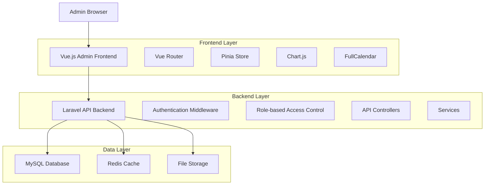
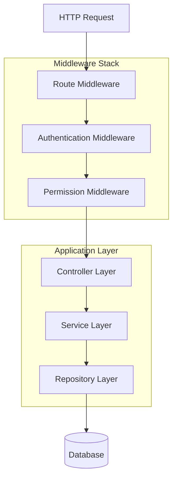
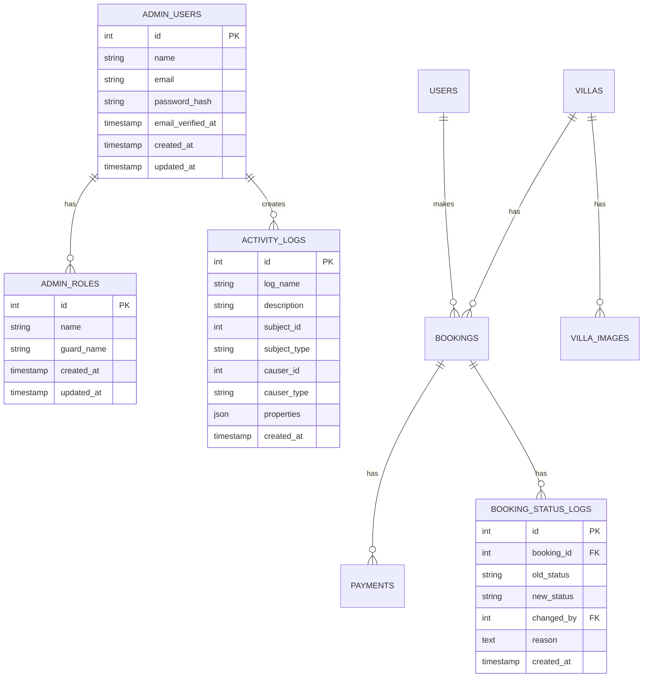

# Villa Kiralama Sistemi - Admin Paneli Teknik Mimari Dokümantasyonu

## 1. Mimari Tasarım



## 2. Teknoloji Açıklaması
- **Frontend**: Vue.js 3 + Composition API + Pinia + Vue Router + Tailwind CSS + Vite
- **Backend**: Laravel 11 + Sanctum Authentication + Spatie Permission
- **Database**: MySQL 8.0
- **Cache**: Redis
- **Charts**: Chart.js
- **Calendar**: FullCalendar.js
- **File Upload**: Laravel Media Library

## 3. Route Tanımları

| Route | Amaç |
|-------|-------|
| /admin | Admin paneli ana sayfası (dashboard) |
| /admin/login | Admin giriş sayfası |
| /admin/dashboard | Dashboard - istatistikler ve genel bakış |
| /admin/villas | Villa yönetimi ana sayfası |
| /admin/villas/create | Yeni villa ekleme formu |
| /admin/villas/:id/edit | Villa düzenleme formu |
| /admin/bookings | Rezervasyon yönetimi ana sayfası |
| /admin/bookings/:id | Rezervasyon detay sayfası |
| /admin/bookings/calendar | Takvim görünümü |
| /admin/users | Kullanıcı yönetimi ana sayfası |
| /admin/users/:id | Kullanıcı profil detayı |
| /admin/payments | Ödeme yönetimi ana sayfası |
| /admin/reports | Raporlar ana sayfası |
| /admin/reports/revenue | Gelir raporları |
| /admin/reports/occupancy | Doluluk raporları |
| /admin/settings | Sistem ayarları |

## 4. API Tanımları

### 4.1 Temel API

**Admin Authentication**
```
POST /api/admin/login
```

Request:
| Parametre | Tip | Zorunlu | Açıklama |
|-----------|-----|---------|----------|
| email | string | true | Admin e-posta adresi |
| password | string | true | Şifre |

Response:
| Parametre | Tip | Açıklama |
|-----------|-----|----------|
| success | boolean | İşlem durumu |
| token | string | API erişim token'ı |
| user | object | Admin kullanıcı bilgileri |

**Dashboard İstatistikleri**
```
GET /api/admin/dashboard/stats
```

Response:
```json
{
  "total_villas": 25,
  "active_bookings": 12,
  "monthly_revenue": 45000,
  "total_users": 150,
  "pending_bookings": 3
}
```

**Villa Yönetimi**
```
GET /api/admin/villas
POST /api/admin/villas
GET /api/admin/villas/{id}
PUT /api/admin/villas/{id}
DELETE /api/admin/villas/{id}
```

**Rezervasyon Yönetimi**
```
GET /api/admin/bookings
GET /api/admin/bookings/{id}
PUT /api/admin/bookings/{id}/approve
PUT /api/admin/bookings/{id}/cancel
GET /api/admin/bookings/calendar
```

**Kullanıcı Yönetimi**
```
GET /api/admin/users
GET /api/admin/users/{id}
PUT /api/admin/users/{id}
POST /api/admin/users/{id}/assign-role
```

**Ödeme Yönetimi**
```
GET /api/admin/payments
GET /api/admin/payments/{id}
POST /api/admin/payments/{id}/refund
```

**Raporlar**
```
GET /api/admin/reports/revenue
GET /api/admin/reports/occupancy
GET /api/admin/reports/export
```

## 5. Sunucu Mimarisi



## 6. Veri Modeli

### 6.1 Veri Modeli Tanımı



### 6.2 Veri Tanımlama Dili

**Admin Users Tablosu**
```sql
-- Admin kullanıcıları tablosu
CREATE TABLE admin_users (
    id BIGINT UNSIGNED PRIMARY KEY AUTO_INCREMENT,
    name VARCHAR(255) NOT NULL,
    email VARCHAR(255) UNIQUE NOT NULL,
    email_verified_at TIMESTAMP NULL,
    password VARCHAR(255) NOT NULL,
    remember_token VARCHAR(100) NULL,
    created_at TIMESTAMP DEFAULT CURRENT_TIMESTAMP,
    updated_at TIMESTAMP DEFAULT CURRENT_TIMESTAMP ON UPDATE CURRENT_TIMESTAMP
);

-- Admin rolleri tablosu
CREATE TABLE roles (
    id BIGINT UNSIGNED PRIMARY KEY AUTO_INCREMENT,
    name VARCHAR(255) NOT NULL,
    guard_name VARCHAR(255) NOT NULL,
    created_at TIMESTAMP DEFAULT CURRENT_TIMESTAMP,
    updated_at TIMESTAMP DEFAULT CURRENT_TIMESTAMP ON UPDATE CURRENT_TIMESTAMP
);

-- Admin kullanıcı-rol ilişkisi
CREATE TABLE model_has_roles (
    role_id BIGINT UNSIGNED,
    model_type VARCHAR(255),
    model_id BIGINT UNSIGNED,
    PRIMARY KEY (role_id, model_id, model_type),
    FOREIGN KEY (role_id) REFERENCES roles(id) ON DELETE CASCADE
);

-- Aktivite logları
CREATE TABLE activity_log (
    id BIGINT UNSIGNED PRIMARY KEY AUTO_INCREMENT,
    log_name VARCHAR(255) NULL,
    description TEXT NOT NULL,
    subject_type VARCHAR(255) NULL,
    subject_id BIGINT UNSIGNED NULL,
    causer_type VARCHAR(255) NULL,
    causer_id BIGINT UNSIGNED NULL,
    properties JSON NULL,
    batch_uuid CHAR(36) NULL,
    created_at TIMESTAMP DEFAULT CURRENT_TIMESTAMP,
    updated_at TIMESTAMP DEFAULT CURRENT_TIMESTAMP ON UPDATE CURRENT_TIMESTAMP
);

-- Rezervasyon durum değişiklik logları
CREATE TABLE booking_status_logs (
    id BIGINT UNSIGNED PRIMARY KEY AUTO_INCREMENT,
    booking_id BIGINT UNSIGNED NOT NULL,
    old_status VARCHAR(50) NOT NULL,
    new_status VARCHAR(50) NOT NULL,
    changed_by BIGINT UNSIGNED NOT NULL,
    reason TEXT NULL,
    created_at TIMESTAMP DEFAULT CURRENT_TIMESTAMP,
    FOREIGN KEY (booking_id) REFERENCES bookings(id) ON DELETE CASCADE,
    FOREIGN KEY (changed_by) REFERENCES admin_users(id)
);

-- İndeksler
CREATE INDEX idx_activity_log_subject ON activity_log(subject_type, subject_id);
CREATE INDEX idx_activity_log_causer ON activity_log(causer_type, causer_id);
CREATE INDEX idx_booking_status_logs_booking ON booking_status_logs(booking_id);
CREATE INDEX idx_booking_status_logs_date ON booking_status_logs(created_at DESC);

-- Başlangıç verileri
INSERT INTO roles (name, guard_name) VALUES 
('super-admin', 'admin'),
('admin', 'admin'),
('moderator', 'admin');

INSERT INTO admin_users (name, email, password) VALUES 
('Super Admin', 'admin@villakiralama.com', '$2y$10$92IXUNpkjO0rOQ5byMi.Ye4oKoEa3Ro9llC/.og/at2.uheWG/igi');
```

## 7. Güvenlik ve Yetkilendirme

### 7.1 Authentication
- Laravel Sanctum ile token-based authentication
- Admin kullanıcıları için ayrı guard tanımı
- Session timeout: 8 saat
- Password policy: minimum 8 karakter, büyük/küçük harf, sayı

### 7.2 Authorization
- Spatie Laravel Permission paketi kullanımı
- Role-based access control (RBAC)
- Route-level permission kontrolü
- API endpoint'leri için middleware koruması

### 7.3 Güvenlik Önlemleri
- CSRF token koruması
- Rate limiting (60 request/minute)
- SQL injection koruması (Eloquent ORM)
- XSS koruması (input sanitization)
- File upload güvenliği (mime type kontrolü)

## 8. Performans Optimizasyonu

### 8.1 Caching Strategy
- Redis ile dashboard istatistikleri cache (5 dakika)
- Villa listesi cache (30 dakika)
- User permissions cache (1 saat)
- Query result caching for reports

### 8.2 Database Optimization
- Proper indexing on frequently queried columns
- Database query optimization
- Eager loading for relationships
- Pagination for large datasets

### 8.3 Frontend Optimization
- Vue.js lazy loading for routes
- Component-level code splitting
- Image optimization and lazy loading
- Debounced search inputs
- Virtual scrolling for large lists