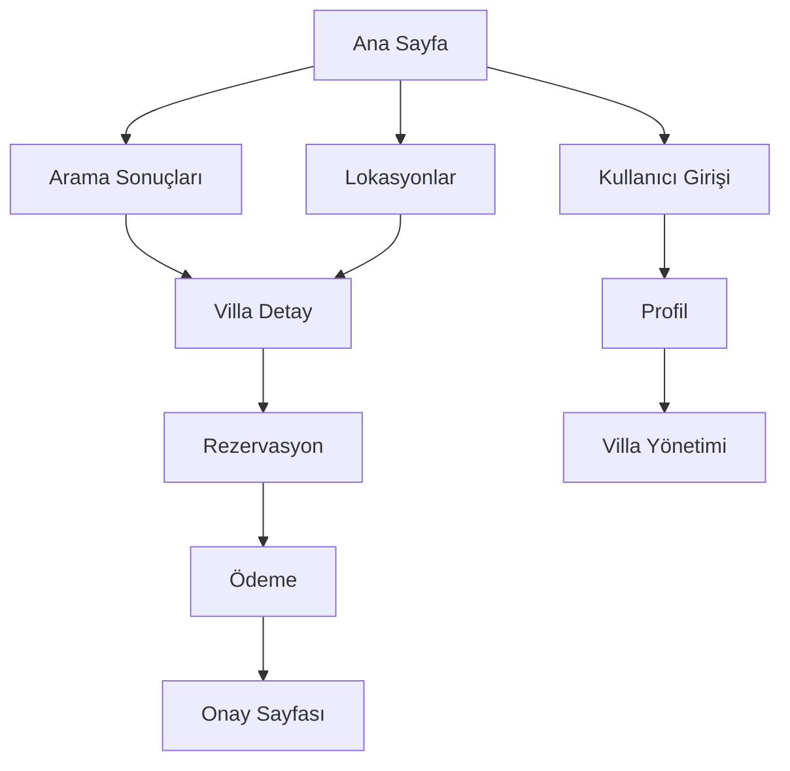

# Premium Villa Kiralama Sistemi - Ürün Gereksinim Dokümanı

## 1. Ürün Genel Bakış
Airbnb ve Booking.com benzeri profesyonel bir premium villa kiralama platformu. Kullanıcıların lüks villaları kolayca keşfedebileceği, rezervasyon yapabileceği ve güvenli ödeme işlemlerini gerçekleştirebileceği modern bir web uygulaması.

Sistem, villa sahipleri ve kiracılar arasında güvenli bir köprü kurarak, yüksek kaliteli konaklama deneyimi sunar. Gelişmiş filtreleme, harita entegrasyonu ve yakındaki aktiviteler özelliği ile kullanıcı deneyimini maksimize eder.

## 2. Temel Özellikler

### 2.1 Kullanıcı Rolleri
| Rol | Kayıt Yöntemi | Temel Yetkiler |
|-----|---------------|----------------|
| Misafir Kullanıcı | E-posta ile kayıt | Villa arama, görüntüleme, rezervasyon yapma |
| Villa Sahibi | E-posta ile kayıt + onay süreci | Villa ekleme, takvim yönetimi, rezervasyon takibi |
| Admin | Sistem tarafından oluşturulur | Tüm sistem yönetimi, kullanıcı ve villa onayları |

### 2.2 Özellik Modülleri
Premium villa kiralama sistemi aşağıdaki ana sayfalardan oluşur:
1. **Ana Sayfa**: hero bölümü, arama çubuğu, öne çıkan villalar listesi, kategoriler
2. **Villa Detay Sayfası**: villa bilgileri, fotoğraf galerisi, uygunluk takvimi, rezervasyon formu, yakındaki aktiviteler
3. **Arama ve Filtreleme Sayfası**: gelişmiş filtreleme seçenekleri, harita görünümü, sonuç listesi
4. **Lokasyonlar Sayfası**: interaktif harita, bölgesel villa dağılımı, popüler destinasyonlar
5. **Rezervasyon Sayfası**: rezervasyon detayları, ödeme formu, güvenli ödeme işlemi
6. **Kullanıcı Profili**: hesap bilgileri, rezervasyon geçmişi, favori villalar
7. **Villa Yönetim Paneli**: villa ekleme/düzenleme, takvim yönetimi, rezervasyon takibi

### 2.3 Sayfa Detayları
| Sayfa Adı | Modül Adı | Özellik Açıklaması |
|-----------|-----------|--------------------|
| Ana Sayfa | Hero Bölümü | Arama çubuğu, lokasyon ve tarih seçimi, misafir sayısı |
| Ana Sayfa | Öne Çıkan Villalar | En popüler villaların kartlar halinde gösterimi |
| Ana Sayfa | Kategoriler | Villa tiplerini gösteren kategori butonları |
| Villa Detay | Fotoğraf Galerisi | Yüksek çözünürlüklü villa fotoğrafları, lightbox görünümü |
| Villa Detay | Uygunluk Takvimi | Müsait/dolu günlerin gösterimi, tarih seçimi |
| Villa Detay | Rezervasyon Formu | Tarih seçimi, misafir sayısı, fiyat hesaplama |
| Villa Detay | Yakındaki Aktiviteler | Çevredeki turistik yerler, restoranlar, aktiviteler |
| Arama Sayfası | Gelişmiş Filtreler | Fiyat aralığı, villa özellikleri, konum filtreleri |
| Arama Sayfası | Harita Görünümü | Villaların harita üzerinde işaretlenmesi |
| Lokasyonlar | İnteraktif Harita | Tüm villaların konumlarını gösteren harita |
| Lokasyonlar | Bölgesel Dağılım | Şehir/bölge bazında villa sayıları |
| Rezervasyon | Ödeme Formu | Kredi kartı bilgileri, güvenli ödeme işlemi |
| Rezervasyon | Rezervasyon Özeti | Seçilen villa, tarihler, toplam fiyat |
| Kullanıcı Profili | Hesap Bilgileri | Kişisel bilgiler düzenleme, şifre değiştirme |
| Kullanıcı Profili | Rezervasyon Geçmişi | Geçmiş ve aktif rezervasyonların listesi |
| Villa Yönetimi | Villa Ekleme | Villa bilgileri, fotoğraf yükleme, özellik seçimi |
| Villa Yönetimi | Takvim Yönetimi | Müsaitlik durumu güncelleme, fiyat belirleme |

## 3. Temel Süreçler

**Misafir Kullanıcı Akışı:**
Kullanıcı ana sayfada lokasyon ve tarih seçerek arama yapar → Arama sonuçlarında villaları filtreler → Villa detayına giderek bilgileri inceler → Uygunluk takviminden tarih seçer → Rezervasyon formunu doldurur → Güvenli ödeme işlemini tamamlar → Rezervasyon onayı alır.

**Villa Sahibi Akışı:**
Villa sahibi hesap oluşturur → Villa bilgilerini ekler ve fotoğrafları yükler → Uygunluk takvimini düzenler → Fiyatlandırma yapar → Rezervasyon taleplerini yönetir → Misafirlerle iletişim kurar.

## 4. Kullanıcı Arayüzü Tasarımı

### 4.1 Tasarım Stili
- **Ana ve ikincil renkler**: Mavi tonları (#2563EB, #1E40AF), beyaz (#FFFFFF), gri tonları (#F8FAFC, #64748B)
- **Buton stili**: Yuvarlatılmış köşeli (border-radius: 8px), hover efektleri
- **Font ve boyutlar**: Inter font ailesi, başlıklar 24-32px, metin 14-16px
- **Layout stili**: Kart tabanlı tasarım, üst navigasyon menüsü, grid sistem
- **İkon stili**: Feather Icons, minimalist ve modern görünüm

### 4.2 Sayfa Tasarım Genel Bakışı

| Sayfa Adı | Modül Adı | UI Elementleri |
|-----------|-----------|----------------|
| Ana Sayfa | Hero Bölümü | Büyük arama çubuğu, gradient arka plan, call-to-action butonları |
| Ana Sayfa | Villa Kartları | Fotoğraf, başlık, konum, fiyat, yıldız puanı |
| Villa Detay | Fotoğraf Galerisi | Grid layout, hover efektleri, modal görünüm |
| Villa Detay | Takvim | İnteraktif tarih seçici, müsait/dolu günler renk kodlaması |
| Arama Sayfası | Filtre Paneli | Sidebar layout, checkbox ve slider kontrolleri |
| Arama Sayfası | Harita | Google Maps entegrasyonu, custom marker'lar |
| Rezervasyon | Ödeme Formu | Güvenli form alanları, SSL sertifikası göstergesi |

### 4.3 Responsive Tasarım
Mobil öncelikli tasarım yaklaşımı ile desktop, tablet ve mobil cihazlarda optimize edilmiş görünüm. Touch etkileşimleri için büyük butonlar ve kolay navigasyon.