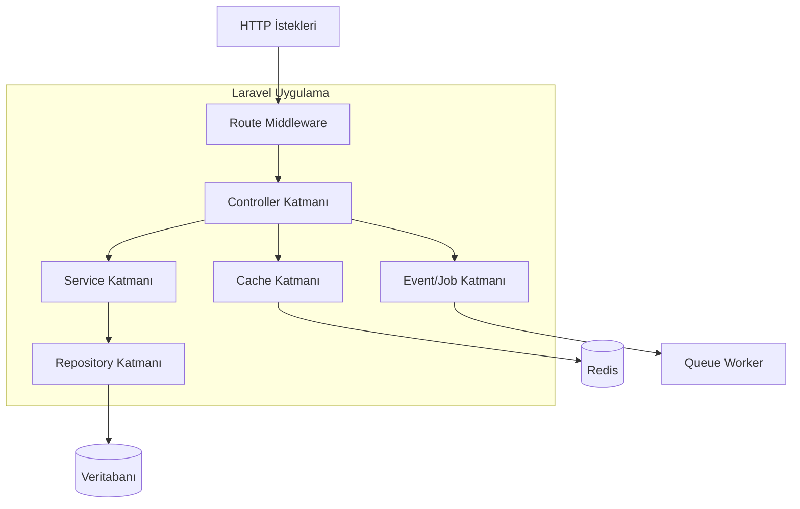
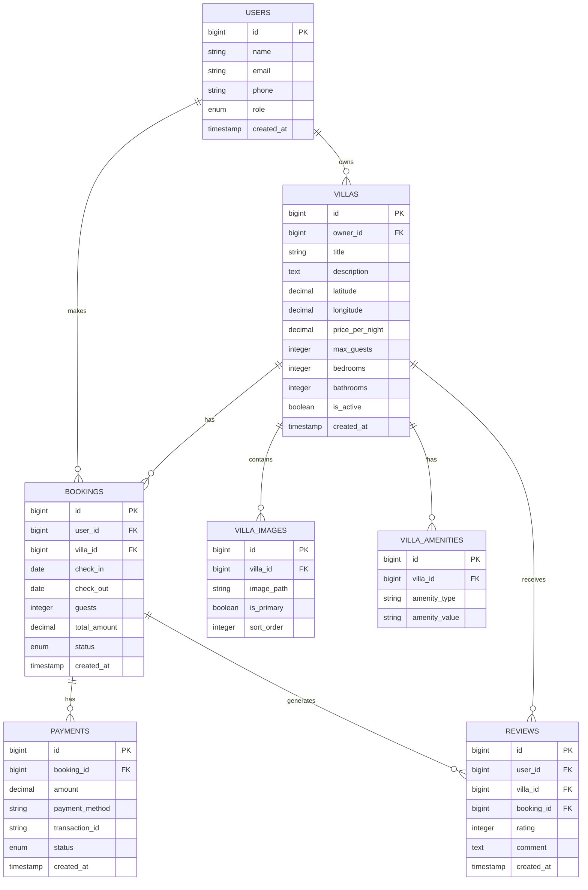

# Premium Villa Kiralama Sistemi - Teknik Mimari Dokümanı

## 1. Mimari Tasarım

```mermaid
graph TD
    A[Kullanıcı Tarayıcısı] --> B[Laravel Frontend (Blade + Vue.js)]
    B --> C[Laravel Backend API]
    C --> D[MySQL Veritabanı]
    C --> E[Redis Cache]
    C --> F[Dosya Depolama]
    C --> G[Harici Servisler]
    
    subgraph "Frontend Katmanı"
        B
    end
    
    subgraph "Backend Katmanı"
        C
        E
    end
    
    subgraph "Veri Katmanı"
        D
        F
    end
    
    subgraph "Harici Servisler"
        G --> H[Google Maps API]
        G --> I[Stripe Ödeme API]
        G --> J[E-posta Servisi]
        G --> K[SMS Servisi]
    end
```

## 2. Teknoloji Açıklaması

- **Frontend**: Laravel Blade Templates + Vue.js 3 + Tailwind CSS + Vite
- **Backend**: Laravel 10 + PHP 8.2
- **Veritabanı**: MySQL 8.0
- **Cache**: Redis 7.0
- **Dosya Depolama**: Laravel Storage (Local/S3)
- **Harici API'ler**: Google Maps, Stripe, SendGrid

## 3. Route Tanımları

| Route | Amaç |
|-------|-------|
| / | Ana sayfa, villa arama ve öne çıkan villalar |
| /villas | Villa arama ve filtreleme sayfası |
| /villa/{id} | Villa detay sayfası |
| /locations | Lokasyonlar harita sayfası |
| /booking/{villa_id} | Rezervasyon sayfası |
| /login | Kullanıcı giriş sayfası |
| /register | Kullanıcı kayıt sayfası |
| /profile | Kullanıcı profil sayfası |
| /dashboard | Villa sahibi yönetim paneli |
| /admin | Admin yönetim paneli |

## 4. API Tanımları

### 4.1 Temel API'ler

**Villa Arama**
```
GET /api/villas/search
```

İstek:
| Parametre Adı | Parametre Tipi | Zorunlu | Açıklama |
|---------------|----------------|---------|----------|
| location | string | false | Şehir veya bölge adı |
| check_in | date | false | Giriş tarihi (Y-m-d) |
| check_out | date | false | Çıkış tarihi (Y-m-d) |
| guests | integer | false | Misafir sayısı |
| min_price | decimal | false | Minimum fiyat |
| max_price | decimal | false | Maksimum fiyat |
| amenities | array | false | Villa özellikleri |

Yanıt:
| Parametre Adı | Parametre Tipi | Açıklama |
|---------------|----------------|-----------|
| data | array | Villa listesi |
| meta | object | Sayfalama bilgileri |

Örnek:
```json
{
  "data": [
    {
      "id": 1,
      "title": "Lüks Deniz Manzaralı Villa",
      "location": "Bodrum, Muğla",
      "price_per_night": 2500,
      "images": ["/storage/villas/1/main.jpg"],
      "rating": 4.8,
      "amenities": ["pool", "wifi", "parking"]
    }
  ],
  "meta": {
    "current_page": 1,
    "total": 25
  }
}
```

**Rezervasyon Oluşturma**
```
POST /api/bookings
```

İstek:
| Parametre Adı | Parametre Tipi | Zorunlu | Açıklama |
|---------------|----------------|---------|----------|
| villa_id | integer | true | Villa ID'si |
| check_in | date | true | Giriş tarihi |
| check_out | date | true | Çıkış tarihi |
| guests | integer | true | Misafir sayısı |
| guest_details | object | true | Misafir bilgileri |
| payment_method | string | true | Ödeme yöntemi |

Yanıt:
| Parametre Adı | Parametre Tipi | Açıklama |
|---------------|----------------|-----------|
| booking_id | integer | Rezervasyon ID'si |
| status | string | Rezervasyon durumu |
| total_amount | decimal | Toplam tutar |

**Ödeme İşlemi**
```
POST /api/payments
```

İstek:
| Parametre Adı | Parametre Tipi | Zorunlu | Açıklama |
|---------------|----------------|---------|----------|
| booking_id | integer | true | Rezervasyon ID'si |
| payment_token | string | true | Stripe payment token |
| amount | decimal | true | Ödeme tutarı |

Yanıt:
| Parametre Adı | Parametre Tipi | Açıklama |
|---------------|----------------|-----------|
| success | boolean | Ödeme durumu |
| transaction_id | string | İşlem ID'si |

## 5. Sunucu Mimarisi



## 6. Veri Modeli

### 6.1 Veri Modeli Tanımı



### 6.2 Veri Tanımlama Dili

**Kullanıcılar Tablosu (users)**
```sql
-- Tablo oluşturma
CREATE TABLE users (
    id BIGINT UNSIGNED AUTO_INCREMENT PRIMARY KEY,
    name VARCHAR(255) NOT NULL,
    email VARCHAR(255) UNIQUE NOT NULL,
    phone VARCHAR(20),
    email_verified_at TIMESTAMP NULL,
    password VARCHAR(255) NOT NULL,
    role ENUM('guest', 'owner', 'admin') DEFAULT 'guest',
    avatar VARCHAR(255),
    is_active BOOLEAN DEFAULT TRUE,
    created_at TIMESTAMP DEFAULT CURRENT_TIMESTAMP,
    updated_at TIMESTAMP DEFAULT CURRENT_TIMESTAMP ON UPDATE CURRENT_TIMESTAMP
);

-- İndeks oluşturma
CREATE INDEX idx_users_email ON users(email);
CREATE INDEX idx_users_role ON users(role);
```

**Villalar Tablosu (villas)**
```sql
-- Tablo oluşturma
CREATE TABLE villas (
    id BIGINT UNSIGNED AUTO_INCREMENT PRIMARY KEY,
    owner_id BIGINT UNSIGNED NOT NULL,
    title VARCHAR(255) NOT NULL,
    description TEXT,
    address TEXT NOT NULL,
    city VARCHAR(100) NOT NULL,
    country VARCHAR(100) NOT NULL,
    latitude DECIMAL(10, 8),
    longitude DECIMAL(11, 8),
    price_per_night DECIMAL(10, 2) NOT NULL,
    max_guests INTEGER NOT NULL,
    bedrooms INTEGER NOT NULL,
    bathrooms INTEGER NOT NULL,
    area_sqm INTEGER,
    is_active BOOLEAN DEFAULT TRUE,
    created_at TIMESTAMP DEFAULT CURRENT_TIMESTAMP,
    updated_at TIMESTAMP DEFAULT CURRENT_TIMESTAMP ON UPDATE CURRENT_TIMESTAMP,
    FOREIGN KEY (owner_id) REFERENCES users(id) ON DELETE CASCADE
);

-- İndeks oluşturma
CREATE INDEX idx_villas_owner_id ON villas(owner_id);
CREATE INDEX idx_villas_city ON villas(city);
CREATE INDEX idx_villas_price ON villas(price_per_night);
CREATE INDEX idx_villas_location ON villas(latitude, longitude);
```

**Rezervasyonlar Tablosu (bookings)**
```sql
-- Tablo oluşturma
CREATE TABLE bookings (
    id BIGINT UNSIGNED AUTO_INCREMENT PRIMARY KEY,
    user_id BIGINT UNSIGNED NOT NULL,
    villa_id BIGINT UNSIGNED NOT NULL,
    check_in DATE NOT NULL,
    check_out DATE NOT NULL,
    guests INTEGER NOT NULL,
    total_amount DECIMAL(10, 2) NOT NULL,
    status ENUM('pending', 'confirmed', 'cancelled', 'completed') DEFAULT 'pending',
    guest_name VARCHAR(255) NOT NULL,
    guest_email VARCHAR(255) NOT NULL,
    guest_phone VARCHAR(20),
    special_requests TEXT,
    created_at TIMESTAMP DEFAULT CURRENT_TIMESTAMP,
    updated_at TIMESTAMP DEFAULT CURRENT_TIMESTAMP ON UPDATE CURRENT_TIMESTAMP,
    FOREIGN KEY (user_id) REFERENCES users(id) ON DELETE CASCADE,
    FOREIGN KEY (villa_id) REFERENCES villas(id) ON DELETE CASCADE
);

-- İndeks oluşturma
CREATE INDEX idx_bookings_user_id ON bookings(user_id);
CREATE INDEX idx_bookings_villa_id ON bookings(villa_id);
CREATE INDEX idx_bookings_dates ON bookings(check_in, check_out);
CREATE INDEX idx_bookings_status ON bookings(status);
```

**Ödemeler Tablosu (payments)**
```sql
-- Tablo oluşturma
CREATE TABLE payments (
    id BIGINT UNSIGNED AUTO_INCREMENT PRIMARY KEY,
    booking_id BIGINT UNSIGNED NOT NULL,
    amount DECIMAL(10, 2) NOT NULL,
    payment_method VARCHAR(50) NOT NULL,
    transaction_id VARCHAR(255),
    stripe_payment_intent_id VARCHAR(255),
    status ENUM('pending', 'completed', 'failed', 'refunded') DEFAULT 'pending',
    processed_at TIMESTAMP NULL,
    created_at TIMESTAMP DEFAULT CURRENT_TIMESTAMP,
    updated_at TIMESTAMP DEFAULT CURRENT_TIMESTAMP ON UPDATE CURRENT_TIMESTAMP,
    FOREIGN KEY (booking_id) REFERENCES bookings(id) ON DELETE CASCADE
);

-- İndeks oluşturma
CREATE INDEX idx_payments_booking_id ON payments(booking_id);
CREATE INDEX idx_payments_transaction_id ON payments(transaction_id);
CREATE INDEX idx_payments_status ON payments(status);
```

**Başlangıç Verileri**
```sql
-- Admin kullanıcısı oluşturma
INSERT INTO users (name, email, password, role, email_verified_at) VALUES 
('Admin User', 'admin@villarentals.com', '$2y$10$92IXUNpkjO0rOQ5byMi.Ye4oKoEa3Ro9llC/.og/at2.uheWG/igi', 'admin', NOW());

-- Örnek villa sahibi
INSERT INTO users (name, email, password, role, email_verified_at) VALUES 
('Villa Sahibi', 'owner@example.com', '$2y$10$92IXUNpkjO0rOQ5byMi.Ye4oKoEa3Ro9llC/.og/at2.uheWG/igi', 'owner', NOW());

-- Örnek villa
INSERT INTO villas (owner_id, title, description, address, city, country, latitude, longitude, price_per_night, max_guests, bedrooms, bathrooms, area_sqm) VALUES 
(2, 'Lüks Deniz Manzaralı Villa', 'Muhteşem deniz manzaralı, özel havuzlu lüks villa', 'Yalıkavak Mahallesi, Bodrum', 'Bodrum', 'Türkiye', 37.1081, 27.2612, 2500.00, 8, 4, 3, 350);
```